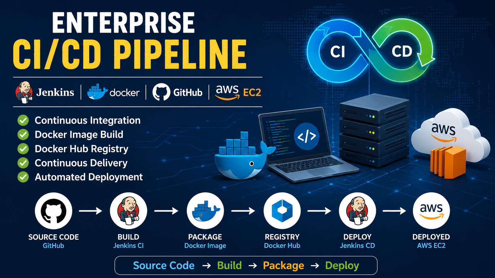
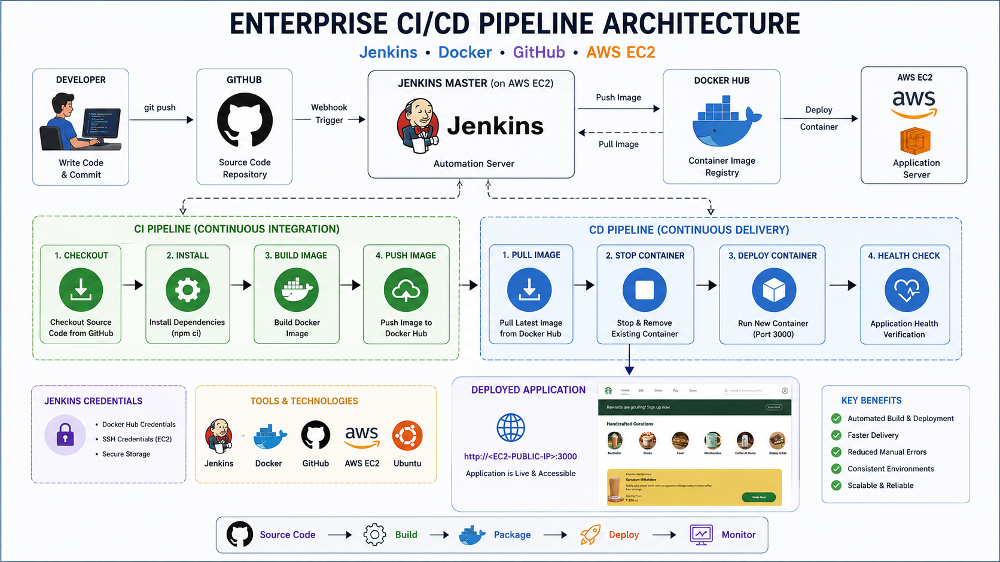
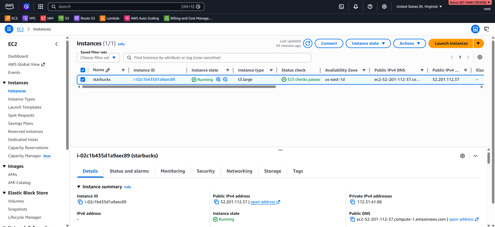
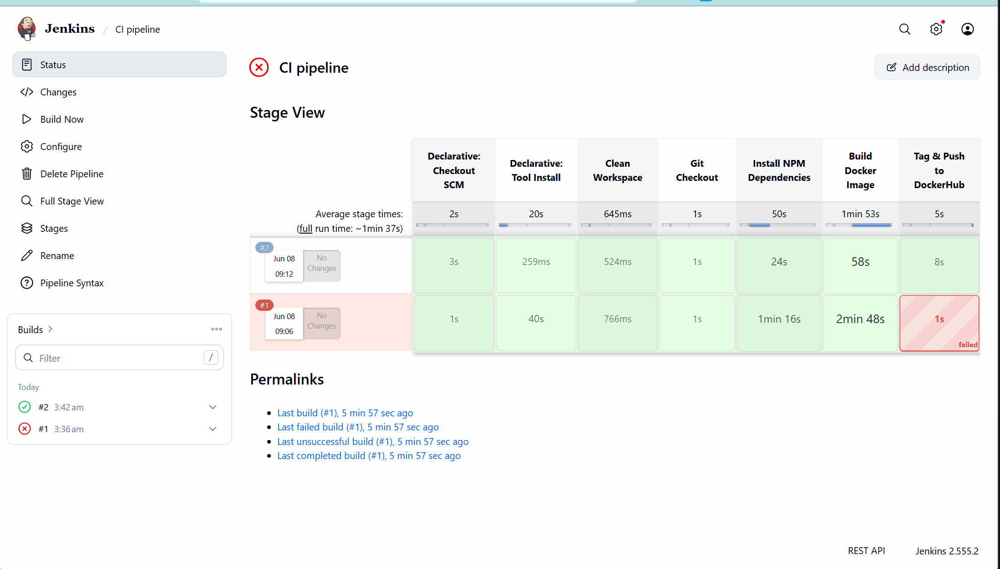
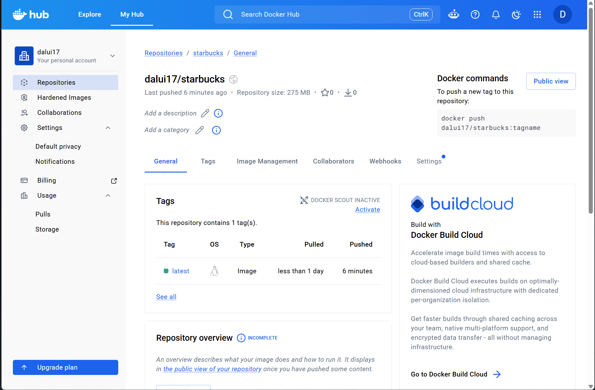
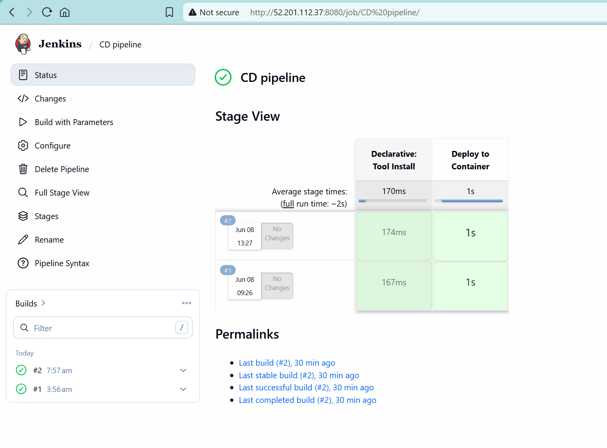
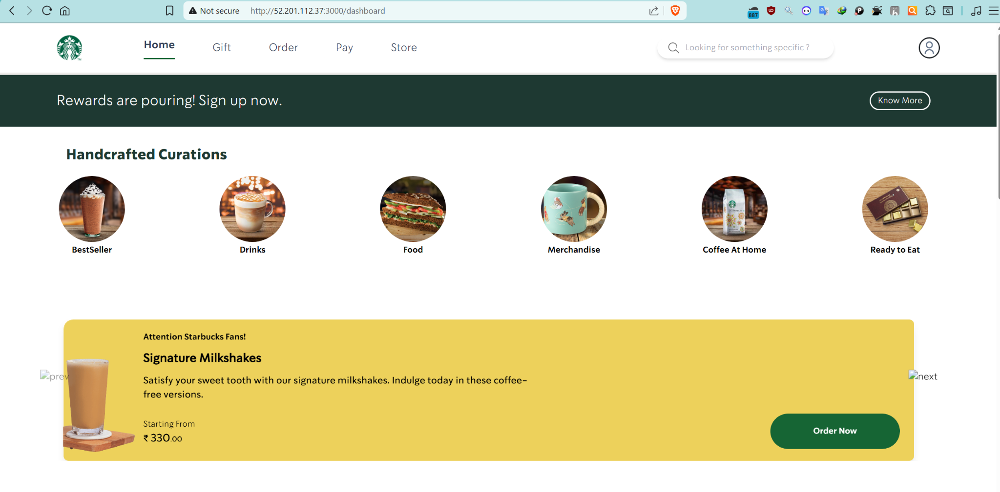

# 🚀 Enterprise CI/CD Pipeline using Jenkins, Docker & AWS EC2

<p align="center">


</p>


---

<p align="center">
  
</p>

---

## 📖 Project Overview

This project demonstrates a complete Enterprise CI/CD implementation using Jenkins, Docker, GitHub, Docker Hub, and AWS EC2.

The pipeline automates the entire software delivery lifecycle:

✅ Source Code Management

✅ Continuous Integration

✅ Docker Image Build

✅ Artifact Management

✅ Continuous Delivery

✅ Automated Deployment

The application source code is stored in GitHub, Jenkins automates the build process, Docker packages the application, Docker Hub stores the artifact, and Jenkins CD Pipeline deploys the latest version to AWS EC2.

---

## 📚 Documentation

A complete beginner-friendly step-by-step implementation guide is available here:

👉 [Complete Setup Guide](docs/complete-setup-guide.md)


---

# 🏗️ Solution Architecture

<p align="center">
  
</p>

---

# ⚙️ Technology Stack

| Category | Tools |
|-----------|---------|
| Source Control | GitHub |
| CI Tool | Jenkins |
| Containerization | Docker |
| Container Registry | Docker Hub |
| Cloud Platform | AWS EC2 |
| Operating System | Ubuntu Linux |
| Pipeline | Jenkins Declarative Pipeline |
| Deployment | Docker Containers |

---


# 🔄 End-to-End Workflow

```text
Developer
    │
    ▼
GitHub Repository
    │
    ▼
Jenkins CI Pipeline
    │
    ├── Source Code Checkout
    ├── Install Dependencies
    ├── Build Docker Image
    └── Push Image to Docker Hub
    │
    ▼
Docker Hub Registry
    │
    ▼
Jenkins CD Pipeline
    │
    ├── Pull Latest Image
    ├── Stop Existing Container
    ├── Deploy New Container
    └── Health Check
    │
    ▼
AWS EC2 Instance
    │
    ▼
Live Application
```

---

# 🔨 CI Pipeline Stages

### Stage 1 — Source Code Checkout

Jenkins pulls the latest source code from GitHub.

### Stage 2 — Install Dependencies

Application dependencies are installed.

### Stage 3 — Build Docker Image

Docker image is generated using Dockerfile.

### Stage 4 — Push Image

Docker image is pushed to Docker Hub Registry.

---


# 🚀 CD Pipeline Stages

### Stage 1 — Pull Latest Image

Latest Docker image is downloaded.

### Stage 2 — Stop Existing Container

Previously running container is stopped and removed.

### Stage 3 — Deploy Container

New application container is launched.

### Stage 4 — Health Verification

Application availability is validated.

---

# 📂 Repository Structure

```text
jenkins-cicd-docker-aws/
│
├── screenshots/
│   ├── banner.png
│   ├── architecture.png
│   ├── ec2-setup.png
│   ├── jenkins-installation.png
│   ├── ci-pipeline-success.png
│   ├── dockerhub-push.png
│   ├── cd-pipeline-success.png
│   └── deployed-application.png
│
├── Jenkinsfile-CI
├── Jenkinsfile-CD
├── Dockerfile
└── README.md
```

---

# 📸 Project Screenshots

## AWS EC2 & Jenkins Setup



---

## Jenkins CI Pipeline



---

## Docker Hub Repository



---

## Jenkins CD Pipeline



---

## Application Deployment



---

# 🔐 Security Implementation

- Jenkins Credential Manager
- Docker Hub Secure Authentication
- AWS Security Groups
- Private Credential Storage
- Controlled Deployment Access

---

# 🎯 Key Features

- Automated CI/CD Pipeline
- Jenkins Pipeline as Code
- Dockerized Application Deployment
- Docker Hub Integration
- AWS EC2 Deployment
- Secure Credential Management
- Continuous Integration
- Continuous Delivery
- Automated Rollout Process
- Multi-Environment Deployment Ready

---

# 📈 Business Benefits

- Reduced Manual Deployment Effort
- Faster Release Cycles
- Consistent Deployment Process
- Improved Reliability
- Better Traceability
- Automated Delivery Workflow
- Reduced Human Errors

---

# 🎓 Learning Outcomes

- Jenkins Administration
- Jenkins Declarative Pipelines
- Docker Container Lifecycle
- Docker Hub Registry Management
- AWS EC2 Administration
- Continuous Integration
- Continuous Delivery
- Deployment Automation
- DevOps Best Practices

---

# 📝 Resume Highlights

- Designed and implemented an end-to-end CI/CD pipeline using Jenkins, Docker, GitHub, and AWS EC2.
- Automated application build, packaging, and deployment processes.
- Integrated Docker Hub as a centralized artifact repository.
- Configured Jenkins credentials for secure authentication.
- Implemented Continuous Integration and Continuous Delivery workflows.
- Deployed containerized applications on AWS infrastructure.

---


# 👨‍💻 Author

### Anirban Dalui

DevOps Engineer | AWS | Docker | Jenkins | Kubernetes | Terraform | Ansible

---


⭐ If you found this project useful, feel free to Star the repository.
